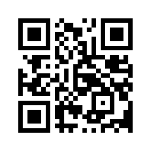
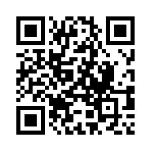
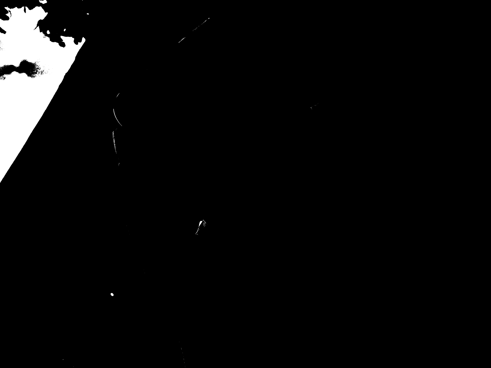
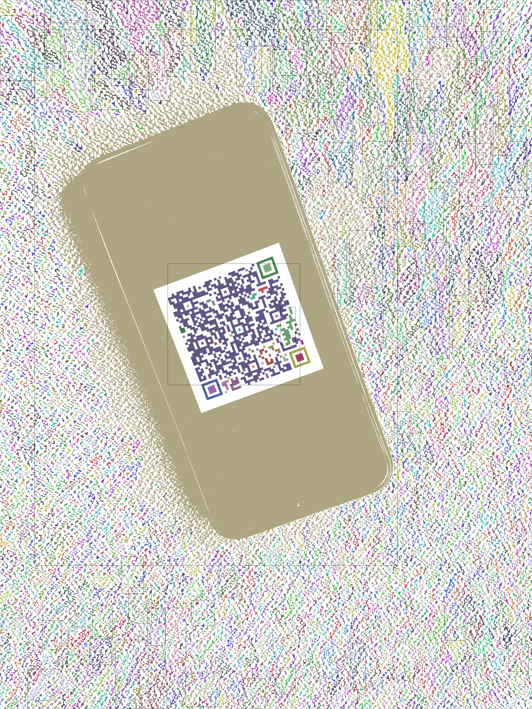
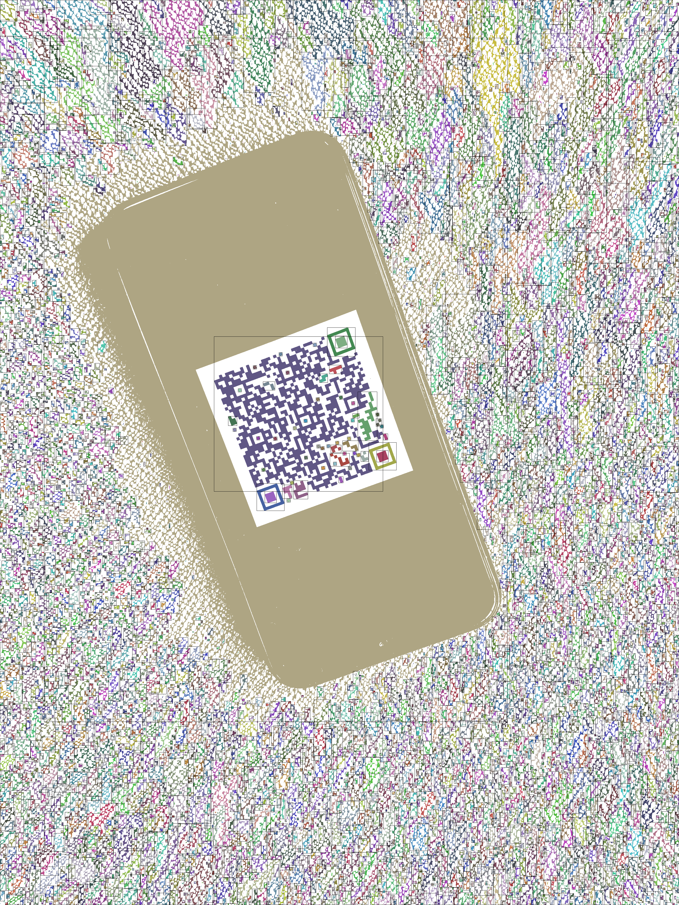
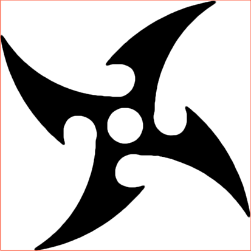

# QR Code Finder


## What is a QR Code?

A [Quick Response (QR) code](https://en.wikipedia.org/wiki/QR_code) is two-dimensional [**barcode**](https://en.wikipedia.org/wiki/Barcode) first [designed in 1994](https://www.youtube.com/watch?v=LS1wrEv-fjk) for the automotive industry in Japan. A **barcode** is a machine-readable optical label that represents data.

A QR code consists of black squares arranged in a square grid on a white background, which can be read by any devices that have an embedded camera (QR code **scanner**), typically a smartphone. Data are then extracted from patterns that are present in both horizontal and vertical components of the image.

One common usage of a QR code is to open a website in a web browser on the device that captures the QR code:


The amount of data that can be stored in a QR code symbol depends on the **type** of the data (numeric, alphanumeric, binary, etc.), the **version** of the QR code, and the **error correction** level:

| Data type    | Max. characters |
| ------------ | --------------- |
| Numeric      | 7,089           |
| Alphanumeric | 4,296           |
| Binary       | 2,953           |

A QR code uses the [Reed–Solomon error correction](https://en.wikipedia.org/wiki/Reed%E2%80%93Solomon_error_correction) algorithm with four error correction levels. The higher the error correction level, the less storage capacity. The following table lists the approximate error correction capability at each of the four levels:

| Level        | Restorable characters |
| ------------ | --------------------- |
| **L**ow      | 7%                    |
| **M**edium   | 15%                   |
| **Q**uartile | 25%                   |
| **H**igh     | 30%                   |

Examples of QR code that represent the same data but with increasing error correction levels:

| Level `L`                                 | Level `M`                                 | Level `Q`                                 | Level `H`                                 |
| ----------------------------------------- | ----------------------------------------- | ----------------------------------------- | ----------------------------------------- |
|  |  |  |  |

Examples of damaged or embellished QR codes that will still scan correctly thanks to error correction:

| Damaged QR Code                                   | QR Code with Logo                       |
| ------------------------------------------------- | --------------------------------------- |
|  |  |

## Your Mission

There are few existing Python implementations of QR code reader ([`pyzbar`](https://github.com/NaturalHistoryMuseum/pyzbar), [`qrtools`](https://github.com/primetang/qrtools), others), but they all depend on other libraries ([OpenCV](https://opencv.org/), [Zbar](http://zbar.sourceforge.net/)), which your grandmother won't be able to install the same way on Windows, Mac, and Linux, in just one click, for sure. And you should consider most of the end users like your grandmother.

Your mission, should you choose to accept it, is to write a QR code finder and decoder in **pure Python**, without the help of any computer vision libraries. A **pure Python** library is a library that only contains Python code, and doesn't include, say, C extensions or code in other languages.

_Note: This **pure Python** implementation of a QR code finder and decoder is not intended to be used for real-time QR code decoding; it could take up to several seconds per image to detect and decode a QR code._

# Photo Orientation and Brightness

The first step consists in finding a form that looks like a QR code in an image, whatever its size, its orientation, or even its color.

For examples:

| Input image                     | Output (monochrome)                      |
| ------------------------------- | ---------------------------------------- |
|  |  |
|       |       |

You will write the code of these first waypoints in a Python file named `detector.py`.

## Waypoint 1: Load Image and Correct Orientation

When you load the image file of a photo and you save a new version of this image using the Python Imaging Library (PIL), none of the Exif information of the initial image is saved.

The [Exchangeable image file format (Exif)](https://en.wikipedia.org/wiki/Exif) specification defines an [`Orientation` tag](https://www.sno.phy.queensu.ca/~phil/exiftool/TagNames/EXIF.html) to indicate the [orientation of the camera](https://www.daveperrett.com/articles/2012/07/28/exif-orientation-handling-is-a-ghetto/) relative to the captured scene. This can be used by the camera either to indicate the orientation automatically by an orientation sensor, or to allow the user to indicate the orientation manually by a menu switch, without actually transforming the image data itself.

Write a function `load_image_and_correct_orientation` that takes an argument `file_path_name` that references an image file of a photo, and that returns an object [`Image`](https://pillow.readthedocs.io/en/stable/reference/Image.html) of the photo which orientation may have been corrected.

For example:

```bash
$ exiftool DSC07314.jpg | grep -i orientation
Orientation                     : Rotate 270 CW
Camera Orientation              : Rotate 270 CW
```

```python
>>> from PIL import Image
>>> image = Image.open('DSC07314.jpg')
>>> image.save('DSC07314_orientation_not_corrected.jpg')
>>> image = load_image_and_correct_orientation('DSC07314.jpg')
>>> image.save('DSC07314_orientation_corrected.jpg')
```

| Initial Image         | Orientation Not Corrected                       | Orientation Corrected                       |
| --------------------- | ----------------------------------------------- | ------------------------------------------- |
|  |  |  |

_Note: Your Web browser may not correctly display the initial image, because it may not read the Exif information of the photo, and therefore it doesn't automatically display the image with the right orientation. You can click and save the initial image on your computer and display it with a photo application. You will see that the photo is perfectly oriented._

We suggest you to use the 3rd party library [`exifread`](https://github.com/ianare/exif-py) to extract Exif metadata from tiff and jpeg files.

## Waypoint 2: Convert Image to Monochrome

Write a function `monochromize_image` that takes an argument `image` (an object [`Image`](https://pillow.readthedocs.io/en/stable/reference/Image.html)) and that returns one other object `Image` corresponding to the monochrome version of the image passed to this function.

| Color Version                                 | [Grayscale](https://en.wikipedia.org/wiki/Grayscale) Version (`L`) | Black & White Version (`P`)                            | Monochromized Version                             |
| --------------------------------------------- | ------------------------------------------------------------------ | ------------------------------------------------------ | ------------------------------------------------- |
|          |                            |          |          |
|  |                    |  |  |

_Note: Converting the original image to a [1-bit pixels Black & White](https://pillow.readthedocs.io/en/stable/handbook/concepts.html#concept-modes) version won't be of a great help. Take a closer look at the [image details](qr_code_waypoint2_black_and_white_details.png) of the 1-bit pixels black & white version. The black areas are actually covered with a lot of white pixels, while we need to [unify black area](qr_code_waypoint2_monochrome_details.png) with only black pixels like the monochrome version._

For example:

```python
>>> color_image = Image.open('./photos/DSC07310.jpg')
>>> monochrome_image = monochromize_image(image)
```

Your function `monochromize_image` also accepts an optional argument `brightness`, a float value from `0.0` to `1.0` that represents th brightness used as a [**threshold**](<https://en.wikipedia.org/wiki/Thresholding_(image_processing)>) to divide the grayscale version of the original image into two portions:

- Pixel values (grayscale colors) that are **less than or equal** to this threshold are converted to **black**;
- Pixel values (grayscale colors) **greater than** the threshold are converted to **white**.

_Note: The **threshold** corresponds to `255 * brightness`._

This allows to handle low and high [contrast](<https://en.wikipedia.org/wiki/Contrast_(vision)>) photos for which this threshold should be adapted so that the QR code is clearly visible on the monochrome version.

Example of a high contrast photo:

|                                                                        |                                                                        |                                                                        |
| ---------------------------------------------------------------------- | ---------------------------------------------------------------------- | ---------------------------------------------------------------------- |
|  Original                           |  (`threshold = 16`)   |  (`threshold = 48`)   |
|  (`threshold = 80`)   |  (`threshold = 112`) |  (`threshold = 144`) |
|  (`threshold = 176`) |  (`threshold = 208`) |  (`threshold = 240`) |

Example of a low contrast photo:

|                                                                         |                                                                         |                                                                         |
| ----------------------------------------------------------------------- | ----------------------------------------------------------------------- | ----------------------------------------------------------------------- |
|  Original                           |  (`threshold = 16`)   |  (`threshold = 48`)   |
|  (`threshold = 80`)   |  (`threshold = 112`) |  (`threshold = 144`) |
|  (`threshold = 176`) |  (`threshold = 208`) |  (`threshold = 240`) |

## Waypoint 3: Determine Image Brightness

Depending on the conditions the photo has been captured, whether indoor or outdoor, whether the weather was sunny or cloudy, the brightness of this photo could be totally different. We need to determine, for each particular photo, the appropriate [**brightness**](https://www.allaboutcircuits.com/technical-articles/image-histogram-characteristics-machine-learning-image-processing/) value that our function `monochromize_image` needs to be used to generate a monochrome image with the QR code clearly visible.

The brightness of a photo could be determined from the [**histogram**](https://en.wikipedia.org/wiki/Image_histogram) of the grayscale version of the photo. The histogram corresponds to a list of pixel counts, one for each pixel value in the source image, i.e., the list of pixel counts for each grayscale. The brightness of the image is determined from the number of pixels per gray levels (spatial distribution). If the histogram values are concentrated toward the first levels, the image is darker. If they are concentrated toward the last levels, the image is lighter.

For examples:

|           | Dark                                          | Light                                          |
| --------- | --------------------------------------------- | ---------------------------------------------- |
| Photo     |            |            |
| Histogram |  |  |

<em>Note: The [**contrast**](<https://en.wikipedia.org/wiki/Contrast_(vision)>) is the difference in luminance that makes an object distinguishable.</em>

Write a function `calculate_brightness` that takes an argument `image` (an object [`Image`](https://pillow.readthedocs.io/en/stable/reference/Image.html)) and that returns a float ranging from `0.0` to `1.0`.

For example:

```python
>>> calculate_brightness(Image.open('./samples/20190820_113850.jpg'))
0.40121496996211214
>>> calculate_brightness(Image.open('./samples/20190820_114009.jpg'))
0.2647252011140948
```

_Note: Your function may return slightly different brightness values than these examples. That is totally fine as long as the brightness values returned by your function `calculate_brightness` allows your function `monochromize_image` to generate a monochrome version of your photos with the QR code clearly visible._

# QR Code Detection

A QR Code consists of an array of square modules arranged in an overall square pattern, including a unique **finder pattern** composed of three identical components (also known as **position detection patterns**) located at the left upper, right upper, and left lower corners of the symbol and intended to assist in easy location of its position, size and inclination.


To detect whether an image contains one or more QR codes, we need to find one or more **finder patterns** in this image: a list of combinations of 3 **position detection patterns** each.

## Waypoint 4: Filter Visible Sprites

The sprites corresponding to **position detection patterns** need to be clearly visible in the image, meaning their surface area need to be big enough. If they were too small, we would have difficulties to decode the QR code by reading its _hieroglyphs_ (smaller dots).

Write a function `filter_visible_sprites` that takes two arguments:

- `sprites`: A list of sprites.

- `min_surface_area`: An integer representing the minimal surface area of a sprite's bounding box to consider this sprite as visible.

The function `filter_visible_sprites` returns a list of the `Sprite` objects which surface area is equal to or larger than the specified minimal surface. We will use the function `filter_visible_sprites` to only retain sprites that have a surface visible to the naked eye.

_Note: To drastically improve the performance of the calculation, the surface of a sprite is approximate to the area of its bounding box._

Let's take an example with the following photo. We found **`20,040` sprites** in this photo:

| Photo                        | Sprites                              |
| ---------------------------- | ------------------------------------ |
|  |  |

We apply a filter to the list to only retain sprites with a surface area equal to or greater than `256` pixels:

```python
>>> visible_sprites = filter_visible_sprites(sprites, 256)
>>> print(len(visible_sprites))
3781
```


If the minimal surface area threshold (`min_surface_area`) is too high, your function may not return the sprites corresponding to the **position detection patterns** of a QR code, and therefore your library won't be able to detect the QR code in the image.

For example:

```python
>>> visible_sprites = filter_visible_sprites(sprites, 16384)
>>> print(len(visible_sprites))
118
```



If the minimal surface area threshold (`min_surface_area`) is too low, your function will return way to many sprites which processing may slow down the detection of QR codes in the image.

For example:

```python
>>> visible_sprites = filter_visible_sprites(sprites, 64)
>>> print(len(visible_sprites))
5764
```



_Note: You **MAY** get different results depending on the brightness threshold you use to convert the original photo to a monochrome image._

How could we determine the value of the minimal surface area that could be visible to the naked eye? It **SHOULD** depend on the resolution of the size of the image.

## Waypoint 5: Filter Square Sprites

The **position detection patterns** of a QR code have a square shape. We need to only retain sprites who have a square shape.

Write a function `filter_square_sprites` that takes two arguments:

- `sprites`: A list of `Sprite` objects.

- `similarity_threshold`: A float number between `0.0` and `1.0` of the relative difference of the width and height of the sprite's boundary box over which the sprite is not considered as a square.

The function `filter_square_sprites` returns a list of the `Sprite` objects which boundary box is almost a square.


_Note: To drastically improve the performance of the calculation, the shape of a sprite is approximate to the shape of its bounding box._

## Waypoint 6: Filter Dense Sprites

The previous waypoints suppose that the size and the shape of a sprite is similar to the size and the shape of its bounding box. This assumption was used to improve the performance of calculation. However, the large the bounding box of sprites, the less true this assumption.

For example, the following sprite has a square bounding box. However, the sprite itself is not a square shape:



We need to consider how dense is a sprite, meaning the ratio between the number of pixels that compose a sprite and the surface area of the boundary box of this sprite. We will only retain sprites that are dense.

Write a function `filter_dense_sprites` that takes two arguments:

- `sprites`: A list of `Sprite` objects.

- `density_threshold`: A float number between `0.0` and `1.0` representing the relative difference between the number of pixels of a sprite and the surface area of the boundary box of this sprite, over which the sprite is considered as dense.

The function `filter_dense_sprites` returns a list of the `Sprite` objects that are dense.


## Waypoint 7: Group Sprites by Similar Size and Distance

The sprites representing the 3 **position detection patterns** of a QR code have similar size and one of these 3 sprites is equidistant from the 2 others. Among the 3 possible pairs of these sprites, 2 ot them have the same distance.

We need to group pairs of sprites with similar size and with similar distance. For example, let's consider the following sprites:


We need to group these pairs of sprites (with no particular order) as follows:

```python
[
    [(1, 2), (2, 7), (3, 5), (7, 11)],
    [(4, 6), (8, 9), (9, 10)]
]
```

- **Group 1**: The sprites `1`, `2`, `3`, `5`, `7`, and `11` have similar size. Each pair `(1, 2)`, `(2, 7)`, `(3, 5)` and `(7, 11)` has similar distance between its two sprites.

- **Group 2**: The sprites `4`, `6`, `8`, `9`, and `10` have similar size. Each pair `(4, 6)`, `(8, 9)`, and `(9, 10)` has similar distance between its two sprites.

_Note: A group **MUST** contain at least 2 pairs of sprites._

Write a function `group_sprites_by_similar_size_and_distance` that takes three arguments:

- `sprites`: A list of `Sprite` objects.

- `similar_size_threshold`: A float number between `0.0` and `1.0` representing the [**relative difference**](https://en.wikipedia.org/wiki/Relative_change_and_difference) between the sizes (surface areas) of two sprites below which these sprites are considered similar.

- `similar_distance_threshold`: A float number between `0.0` and `1.0` representing the **relative difference** between the distances from the sprites of 2 pairs below which these pairs are considered having similar distance.

The function `group_sprites_by_similar_size_and_distance` returns a list of groups (lists) of pairs of sprites with the following properties:

- the sprites of a same group have similar size.

- the distance between the sprites of each pair of a same group is equivalent.

## Waypoint 8: Search Position Detection Patterns

3 sprites may possibly correspond to a finder pattern of a QR code if they form an angle almost **orthogonal**.

_Note: Indeed these 3 sprites **MUST** be dense, **MUST** have similar size (surface area), and 2 of these sprites **MUST** be equidistant to the 3rd sprite._


Write a function `search_position_detection_patterns` that takes two arguments:

- `sprite_pairs`: A list of pairs of sprites.

- `orthogonality_threshold`: A float number between `0.0` and `1.0` of the relative difference between the angle of two pairs of sprites less or equal which the two pairs are considered orthogonal.

The function returns a list of 3 sprites (a tuple `upper_left_sprite, upper_right_sprite, lower_left_sprite`) that possibly corresponds to the position detection patterns of a QR code:

- `upper_left_sprite`: A `Sprite` object corresponding to the Position Detection Pattern located at the upper left corner of the QR code.

- `upper_right_sprite`: A `Sprite` object corresponding to the Position Detection Pattern located at the upper right corner of the QR code.

- `lower_left_sprite`: A `Sprite` object corresponding to the Position Detection Pattern located at the lower left corner of the QR code.

_Note: The function expects that the list `sprite_pairs` contains sprites of similar size, and the distance between the two sprites of a pair is similar for each pair; the function doesn't need to verify this assertion._

## Waypoint 9: Filter Matching Inner and Outer Finder Patterns

Write a function `filter_matching_inner_outer_finder_patterns` that takes one argument `finder_patterns` (a list of tuple `upper_left_sprite, upper_right_sprite, lower_left_sprite`). Each tuple corresponds to 3 sprites that may possibly correspond to a finder pattern of a QR code.

The function searches each tuple (**outer finder pattern**) that contains another tuple (**inner finder pattern**).

A tuple contains another tuple if each sprite `upper_left_sprite`, `upper_right_sprite`, and `lower_left_sprite` of this first tuple contains each sprite respectively `upper_left_sprite`, `upper_right_sprite`, and `lower_left_sprite` of the second tuple.

A sprite contains another sprite if the bounding box of this first sprite contains the bounding box of the second sprite.


The function `filter_matching_inner_outer_finder_patterns` returns a list of tuples corresponding to the **outer finder patterns**.


## Waypoint 10: Crop QR Code Image Portion

We are almost done.

Write a function `crop_qr_code_image` that takes two arguments `image` and a tuple `upper_left_sprite, upper_right_sprite, lower_left_sprite` where:

- `image`: A `PIL.Image` instance of the photo where the QR code has been found

- `upper_left_sprite`: A `Sprite` object corresponding to the Position Detection Pattern located at the upper left corner of the QR code.

- `upper_right_sprite`: A `Sprite` object corresponding to the Position Detection Pattern located at the upper right corner of the QR code.

- `lower_left_sprite`: A `Sprite` object corresponding to the Position Detection Pattern located at the lower left corner of the QR code.

The function returns a `PIL.Image` corresponding to the portion of the QR code rotated and cropped from `image`.

_Hint: We remind you how to calculate the new coordinates `(x', y')` of a point `P(x, y)` that is rotated around a point `O(x, y)` by an angle `θ`:_


| Original Image Rotated                              | QR Code Image Portion Cropped                       |
| --------------------------------------------------- | --------------------------------------------------- |
|  |  |
